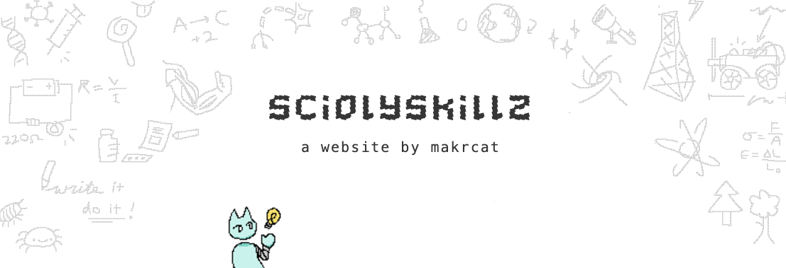

this repo has been to hell and back

migrating to next.js

might take a while

sorry guys 

# sciolyskillz

This is a site to help prep for SciOly, or [Science Olympiad](https://www.soinc.org/). 

## but why?
I noticed that all the scioly resources online were quite scattered, so I hope this website can be a central hub of information, much like https://usaco.guide/.

It's also a way for me to learn more about using React.js and Firebase as a backend, as well how to integrate it with front-end web design :)

## Made for summer of making | hackclub

Check out the project page! I post devlogs here
https://summer.hackclub.com/projects/5460